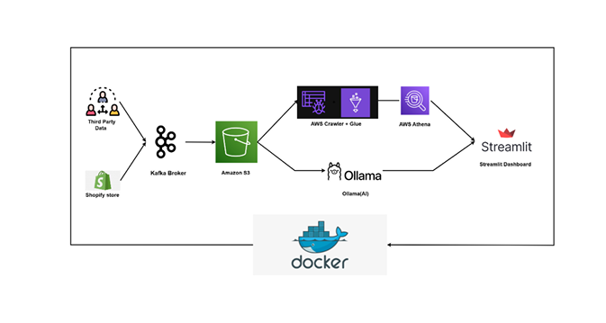

<h1 align="center">🚀 SROAD</h1>

<p align="center">
  <b>Streaming Real-time Operations & Anomaly Detection</b><br>
  A production-grade, cloud-native data engineering platform for real-time
  e-commerce analytics, anomaly detection, and AI-assisted insights.
</p>

<p align="center">
  
</p>

<p align="center">
  
  
  
  
  
  
</p>

<br>

## 🧠 One-Line Explanation
SROAD continuously monitors e-commerce orders in real time, detects anomalies,
and provides instant analytical insights through a live dashboard.

<br>

## 👶 Explain Like I’m 10
Imagine a smart robot watching every order in an online shop.
It tells you how much money you’re making and warns you if something strange happens.

<br>

## ❓ Why Does This Project Exist? (Problem Statement)

Modern e-commerce platforms generate large volumes of operational data every second:
- Orders
- Payments
- Products
- Customer locations

### 🚨 The Problem
Most small and medium businesses:
- Rely on delayed or manual reports
- Cannot analyze data as it arrives
- Detect fraud or revenue drops too late

By the time insights are available, **business impact has already occurred**.

<br>

## 💡 Solution Overview — What I Built

SROAD is a **fully automated, end-to-end real-time data pipeline** that:
- Ingests live order data
- Stores it in a scalable cloud data lake
- Performs serverless analytics
- Detects anomalies
- Explains insights using AI
- Visualizes results in real time

The system is designed to be **scalable, fault-tolerant, and production-ready**.

<br>

## 🧰 Tech Stack & Why These Choices Were Made (IMPORTANT)

### 🐍 Python
**What it is:** A high-level programming language.  
**Why chosen:** Python is simple, readable, and widely used in data engineering.  
**Problem it solved:** Unified language for Kafka streaming, AWS integration, analytics, dashboards, and AI.  
**Why not alternatives:** Faster development and easier experimentation compared to Java or Scala.

---

### 🔥 Apache Kafka
**What it is:** A distributed real-time event streaming platform.  
**Why chosen:** Kafka is designed for high-throughput, fault-tolerant streaming systems.  
**Problem it solved:** Reliable ingestion of real-time order events without data loss.  
**Why not REST polling:** Kafka is push-based, scalable, and handles bursts efficiently.

---

### ☁️ Amazon S3 (Data Lake)
**What it is:** Object storage service on AWS.  
**Why chosen:** Extremely scalable, durable, and cost-effective.  
**Problem it solved:** Centralized storage for both historical (batch) and real-time data.  
**Why not databases:** Databases are expensive and unsuitable for unbounded raw data storage.

---

### 📚 AWS Glue
**What it is:** Serverless data catalog and schema discovery service.  
**Why chosen:** Automatically detects and manages schemas.  
**Problem it solved:** Eliminated manual table definitions for analytics.  
**Why not manual schemas:** Manual schema management is error-prone and unscalable.

---

### 📊 Amazon Athena
**What it is:** Serverless SQL query engine for S3 data.  
**Why chosen:** No infrastructure to manage and pay-per-query pricing.  
**Problem it solved:** Fast analytics directly on raw data.  
**Why not Redshift:** Athena is cheaper and simpler for analytical workloads at this scale.

---

### 📈 Streamlit
**What it is:** Python framework for building data dashboards.  
**Why chosen:** Rapid dashboard development with minimal frontend effort.  
**Problem it solved:** Real-time visualization of analytics and anomalies.  
**Why not React:** Faster development and tighter integration with Python analytics.

---

### 🐳 Docker
**What it is:** Containerization platform.  
**Why chosen:** Ensures consistent execution across environments.  
**Problem it solved:** Dependency and environment mismatch issues.  
**Why not local installs:** Containers make deployment reproducible and scalable.

---

### 🏗️ Terraform
**What it is:** Infrastructure as Code (IaC) tool.  
**Why chosen:** Automates cloud resource provisioning.  
**Problem it solved:** Eliminated manual AWS setup and configuration drift.  
**Why not console setup:** IaC is repeatable, version-controlled, and production-grade.

---

### 🧠 LLaMA (AI Agent)
**What it is:** Large Language Model–based AI agent.  
**Why chosen:** Enables natural language explanations and insights.  
**Problem it solved:** Makes analytics understandable for non-technical users.  
**Why not rule-only systems:** AI adds interpretability and conversational analytics.

<br>

## 🏗️ System Architecture (Workflow)

1. Order data arrives from Shopify or synthetic generators  
2. Apache Kafka streams events in real time  
3. Kafka consumers write data to Amazon S3  
4. AWS Glue catalogs incoming data schemas  
5. Amazon Athena runs analytical SQL queries  
6. AI agent interprets anomalies and trends  
7. Streamlit dashboard displays live insights  

<br>

## ⚙️ Installation & Setup

### Step 1: Clone the repository
```bash
git clone https://github.com/Abhinav-source2/SROAD.git
cd SROAD
````

### Step 2: Install dependencies

```bash
pip install -r requirements.txt
```

### Step 3: Run the system

```bash
docker-compose up
```

<br>

## 📈 Results & Impact

* Near real-time operational visibility
* Automated anomaly detection
* Zero manual reporting
* Scales with data growth

<br>

## 📚 What I Learned

* Real-time data engineering principles
* Cloud-native system design
* Kafka-based streaming pipelines
* Serverless analytics on AWS
* Infrastructure automation using Terraform
* AI integration into analytics systems

<br>

## 🔮 Future Improvements

* ML-based anomaly detection (LSTM, Isolation Forest)
* Revenue forecasting models
* CI/CD automation pipelines
* Kubernetes deployment
* Advanced monitoring and observability
* RAG-powered AI insights

<br>

## ⭐ Why This Project Is Resume-Worthy

This project demonstrates:

* End-to-end system design
* Production-grade data engineering
* Cloud architecture expertise
* Streaming + batch data processing
* Infrastructure automation
* AI-assisted analytics

### 🧾 ATS Keywords

Kafka, AWS, Data Engineering, Streaming, Terraform, Docker, SQL, Python, AI

<br>

## 👤 Authors

**Abhinav Jajoo**

**Chaitanya Aggarwal**
